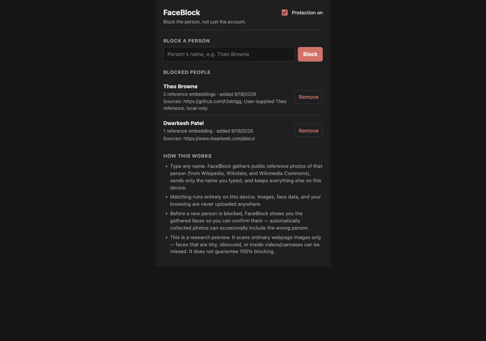
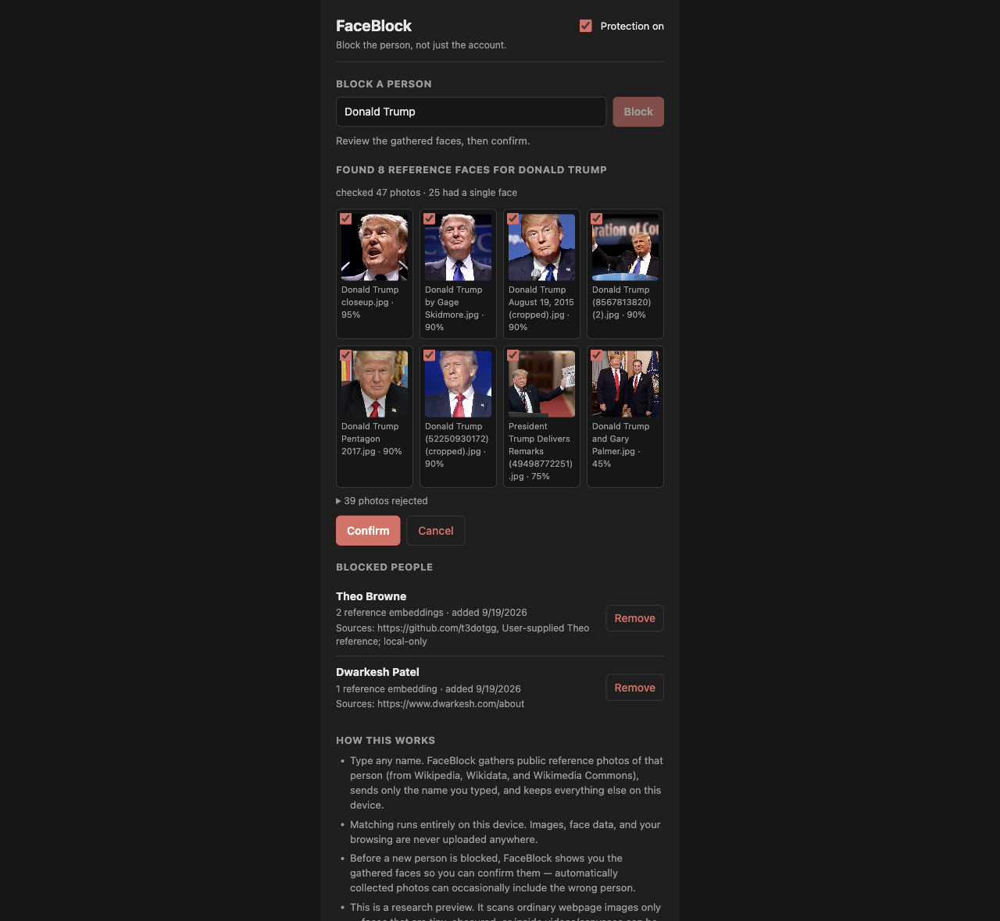
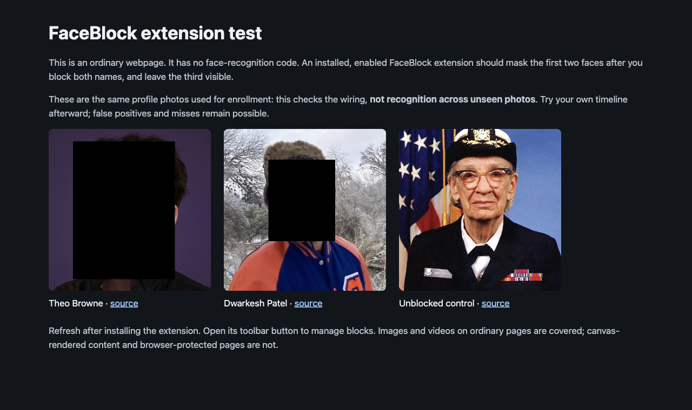
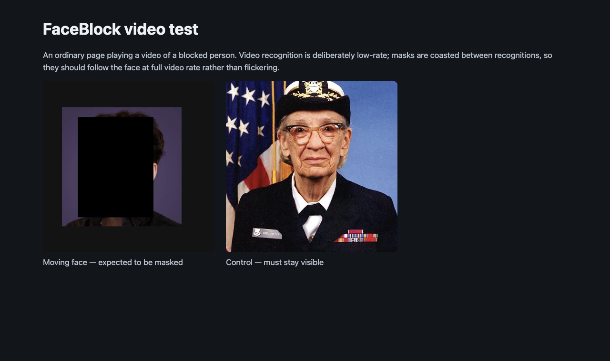

# FaceBlock

**Support this project:** [ko-fi.com/djlougen](https://ko-fi.com/djlougen)

A Chromium browser extension that lets you block a *person* across the web — not just their social accounts. Type a name once, confirm the faces it finds, and FaceBlock draws opaque black masks over matching faces in ordinary webpage images and videos on your device.

## What it does

- **Block people, not accounts.** Enroll a name; FaceBlock then scans visible images and videos on pages you browse and covers matching faces.
- **Name-in enrollment.** You type a person’s name. FaceBlock gathers public reference photos, shows you the faces it kept for confirmation, and only then saves the block. You don’t upload photos yourself.
- **Works on images and video.** Masks follow faces while you scroll and while video plays.
- **Stays on your machine for matching.** Face matching runs in the browser. During enrollment, only the typed name is used to look up public photo sources (the same kind of lookup you’d do in a search box).

This is a research preview. Matching is experimental — expect misses and occasional wrong-person masks. Always review the confirmation faces before saving a block.

## Why you should care

Blocking someone on one site doesn’t stop their face showing up in news articles, clips, memes, or other pages. FaceBlock is for when you want a local, browser-level “don’t show me this person” layer across everyday browsing — without sending your page images to a server for matching.

## How to install / use

### Requirements

- A Chromium browser (Chrome, Edge, Brave, etc.)
- [Bun](https://bun.sh) if you build from source

### Install from source

```bash
git clone https://github.com/DJLougen/faceBlock.git
cd faceBlock
bun install
bun run build:extension
```

Then load it in the browser:

1. Open `chrome://extensions/`
2. Turn on **Developer mode**
3. Click **Load unpacked**
4. Select the `dist-extension/` folder

### Or load a packaged zip

```bash
bun run package
```

That writes `faceBlock-<version>.zip` at the repo root. Extract it and load the extracted folder with **Load unpacked** the same way.

### Use it

1. Click the FaceBlock toolbar icon to open the options page.
2. Type a name (for example, a public figure) and click **Block**.
3. Review the faces FaceBlock gathered. Confirm only if they look right.
4. Browse normally. Matching faces in images and videos get covered with a black mask.
5. On the options page you can remove someone or toggle protection on/off.









## Support

If FaceBlock is useful, you can support Dan here: [https://ko-fi.com/djlougen](https://ko-fi.com/djlougen)
