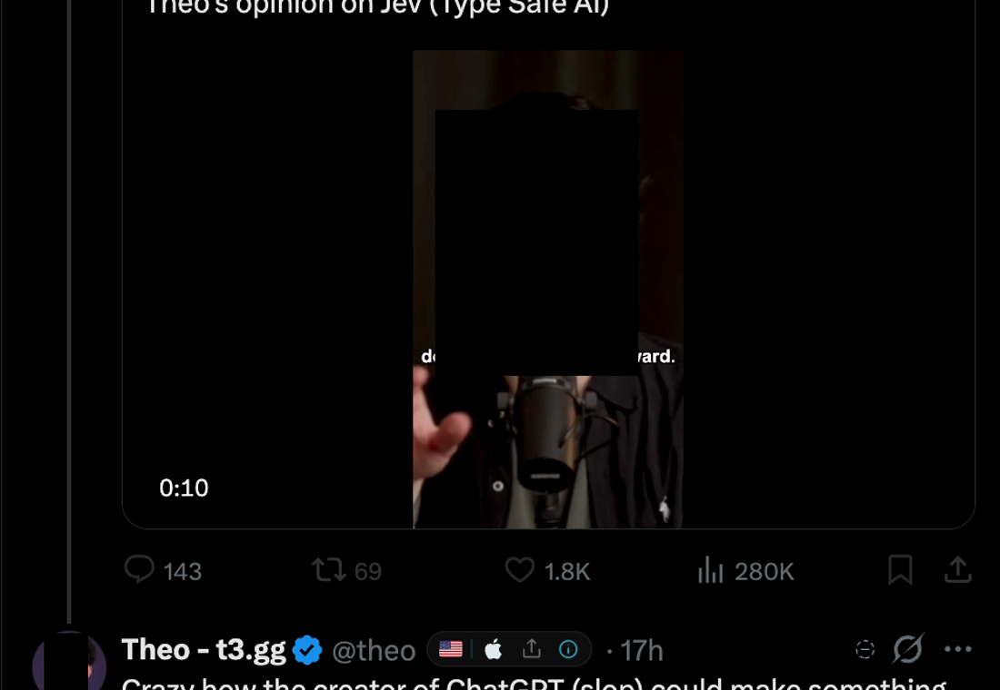

# FaceBlock

**Support this project:** [ko-fi.com/djlougen](https://ko-fi.com/djlougen)

A Chromium extension that blocks a **person** across the web — not just their account. Type a name once, confirm the faces it finds, and FaceBlock covers matching faces with opaque black boxes in ordinary webpage images and videos. Everything runs on your device; nothing but the name you type is ever sent anywhere.

---

## Why this exists

Blocking someone on a social platform only removes *their account*. Their face still shows up in screenshots, reposts, memes, avatars, collages, thumbnails, embedded media, and video — posted by other people entirely. FaceBlock targets the thing you actually don't want to see: the face itself.

It also does not ask you to trust a server. There is no backend. Once installed, it works offline.

---

## Screenshots

Real captures of the built extension running in Chrome. Reproduction steps are in [Reproducing these screenshots](#reproducing-these-screenshots).

### 0. Working on X, in a normal browsing session



This is the real target, in a real session: a post on X with the face inside the **video** masked, and the poster's **avatar** masked too. Nothing else on the page is touched. Every other screenshot below is a controlled fixture; this one is ordinary browsing.

### 1. Manage blocked people


What you see after blocking someone. It says "Learned from 7 photos" rather than storing the photos themselves — only the numbers needed to recognise the person are kept, and the source list stays collapsed unless you want it. **Remove** unblocks; the **Protection** switch pauses everything.

### 2. Confirm the faces it found


Type a name and press **Block**. FaceBlock goes and finds photos of that person itself, then asks **"Is this them?"** and shows what it intends to remember. Untick anything that is not them and press the confirm button. Nothing is saved until you do.

### 3. Blocked faces covered on an ordinary page


A plain webpage with no face-recognition code of its own. Two blocked people are covered; the unrelated control portrait is untouched. Boxes are grown slightly beyond the detected face so hair and edges don't identify anyone.

### 4. Blocked face covered in video


Video works too. Coverage is designed to stay on a *moving* face without processing every frame, which is what keeps it usable on a normal laptop.

---

## Install

Takes about a minute. You need Chrome (or Edge, Brave, Arc — any Chromium browser).

**1. Download this repo.** Green **Code** button above → **Download ZIP** → unzip it
somewhere you'll remember.

> Prefer the command line? `git clone https://github.com/DJLougen/faceBlock.git`

**2. Build it once.** You need [Bun](https://bun.sh) installed, then:

```bash
cd faceBlock
bun install
bun run build:extension
```

That creates a folder called `dist-extension`. (About 19 MB — the face model is small.)

**3. Load it into Chrome.**

1. Go to `chrome://extensions`
2. Turn on **Developer mode** — the switch in the top-right corner
3. Click **Load unpacked** and choose the `dist-extension` folder
4. Pin FaceBlock to your toolbar (the puzzle-piece icon → pin)

**4. Done.** Click the FaceBlock icon and follow the three steps on the page.

> **Why "Developer mode"?** FaceBlock isn't in the Chrome Web Store yet, and that
> switch is the only way Chrome allows an extension to be installed from a folder.
> It doesn't make Chrome a developer tool, and it's the same process used by every
> extension before it's published.

## Use it

1. **Block someone.** Click the toolbar icon, type a name — e.g. *Ada Lovelace* — and press **Block**.
2. **Confirm the faces.** FaceBlock shows the reference faces it found. Untick anything that isn't them, then **Confirm**. This step is deliberate: automatically found photos are occasionally the wrong person, so nothing is ever saved silently.
3. **Browse normally.** Visible images and videos on ordinary pages are checked on your device, and matching faces get covered.
4. **Manage the list** from the options page — every person has a **Remove** button, and **Protection** pauses everything.

### Choosing a name that will work

FaceBlock finds reference photos from public sources, so it works for **public figures, historical figures, and notable people** — not private individuals.

| Name | What happens |
| --- | --- |
| `Donald Trump` | 47 photos checked → 24 with a single face → 6 kept |
| `Ada Lovelace` | 7 faces found → 2 kept (most depictions of her are paintings, which the detector still often can't read) |
| `Theo Browne` | **0 candidates** — those sources have no photos of him, so FaceBlock says so instead of guessing |

If a name isn't covered, FaceBlock tells you plainly rather than filling the list with unrelated faces. You can also enrol someone from your own reference photo.

---

## Privacy

- **The only thing that leaves your device is the name you type.** During enrolment it's sent to public reference-photo APIs to find candidate images — the same information you'd type into a search box.
- **Nothing else is transmitted.** No images, no face crops, no embeddings, no page media, no browsing history, no match results.
- **Reference photos are not kept.** After enrolment the downloads are discarded; only what's needed to recognise the person later stays, plus minimal metadata (name, source URLs, timestamp) in `chrome.storage.local`.
- **Video frames are examined on your device and discarded.**
- Face detection and matching run locally in the browser. No server, no account, no telemetry.

---

## Measured results

Numbers below come from the harness in this repo, on 24 held-out photographs of one person that were **not** used for enrolment, plus timing runs against local fixtures. They are measurements, not marketing: the same protocol was applied before and after each change, and the regressions I hit are in the commit history.

### Detection — 24 held-out photos

| detector configuration | faces found | of those, masked (matched) |
| --- | --- | --- |
| MediaPipe landmarker, defaults | 6 | 5 |
| MediaPipe landmarker, tuned floors + tiled pass | 11 | 8 |
| **YuNet (current)** | **13** | 7 |

The two cases the old detector returned *nothing* for are the interesting ones: a side-on profile, and faces in a wide shot. A crowd photo (an oath ceremony) went from **2 faces to 17**.

### Speed

| | before | after |
| --- | --- | --- |
| 2400×2400 photo | 93 ms | **72 ms** |
| 460×460 photo | 54 ms | **36 ms** |

Download size, after removing an unused second detector and three unrelated ONNX
Runtime builds that were being bundled:

| | before | after |
| --- | --- | --- |
| packaged zip | 48.2 MB | **19.2 MB** |
| unpacked extension | 133 MB | **31 MB** |
| runtime dependencies | 3 | **1** (`onnxruntime-web`) |
| detector pass, 320px input | — | **7 ms** |
| detector pass, 640px input | 24 ms | 24 ms |

The detector was never the bottleneck. Rasterising a 2400×2400 photo pulled ~23 MB of pixels through `getImageData` to feed a 112×112 alignment chip — that was the cost.

### Tests

`bun test tests` — **121 passing**, including 9 that pin the detector's decode arithmetic and non-max suppression, which are easy to get subtly wrong and invisible once buried in a model call.

## Accuracy — read this before trusting it

**This is a research preview, not a privacy guarantee.**

- **Face coverings defeat matching, and no threshold fixes it.** Measured with real photos, not simulations: enrolling a public figure from five plain portraits and then querying photographs of her wearing a surgical-style mask gave similarities of **0.02–0.27** against a 0.40 threshold, while **three unrelated people scored 0.02–0.11**. The two ranges overlap — one masked photo of the right person scored *lower* than a stranger's face. So a masked face cannot be separated from a stranger by any threshold: lowering it to catch masks would start covering innocent people, which is the worse error for this tool.
- **Sunglasses, face coverings and different hair each hurt a little; combined they defeat detection.** Simulated one at a time, similarity fell from 1.00 to 0.65–0.82 and still matched. Combining two made the detector find no face at all.
- **Profile and small faces are handled.** Detector-side work recovered faces in profile and three-quarter views, and small faces in crowds and wide shots that previously returned nothing.
- **Misses are still expected.**
- **Wrong-person matches are possible.**
- **Automatically found reference photos can be the wrong person.** Name lookups are ambiguous — a search for a public figure surfaces impersonators, same-name relatives, commemorative plaques, and AI-generated images. FaceBlock filters these and then asks you to confirm, but it cannot be perfect.
- **Images and video only.** Canvas-rendered content and browser-protected pages (`chrome://`, the Web Store) are not covered.
- **Some video can't be read at all.** A cross-origin video that blocks canvas access can't be examined; it's detected once and skipped rather than retried forever.
- **Coverage can lag briefly on abrupt motion** — a face that changes direction sharply may show a stale box for a moment.
- **Video costs battery.** All video work pauses when the tab is hidden.
- **Local only.** Blocked people live in `chrome.storage.local` and don't sync across devices.
- **Enrolment depends on public sources.** See the table above.

---

## Reproducing these screenshots

Everything above is reproducible. The captures in `docs/screenshots/` were taken from a live Chrome session running the built extension, and the fixture pages ship in this repo.

```bash
bun install
bun run build:extension
bun run dev          # fixture pages on http://127.0.0.1:5173
```

| Screenshot | How to reproduce |
| --- | --- |
| `05-x-timeline.png` | Not a fixture — a frame from an ordinary browsing session on X with a person blocked, showing both a video face and an avatar masked. Reproduce it by blocking someone and scrolling your own timeline. |
| `01-options.png` | Load `dist-extension`, open the options page, and block `Theo Browne` and `Dwarkesh Patel` (both ship in `extension/references.json`, so they enrol immediately). |
| `02-confirm.png` | On the options page, type `Donald Trump` and press **Block**. Wait for it to finish gathering — it downloads roughly 48 photos and examines each — then screenshot the confirmation panel before confirming. |
| `03-masked.png` | With both people above blocked, open `http://127.0.0.1:5173/extension-test.html`. Two faces are covered; the control stays visible. |
| `04-video-masked.png` | With `Theo Browne` blocked, open `http://127.0.0.1:5173/video-test.html`. The moving face is covered. |

The video fixture is generated, not downloaded:

```bash
cd demo/public
ffmpeg -y -f lavfi -i "color=c=0x141414:s=780x660:d=6:r=25" -loop 1 -i samples/theo.jpg \
  -filter_complex "[1:v]format=rgba[face];[0:v][face]overlay=x='150+40*sin(t*2)':y=100:shortest=1,format=yuv420p" \
  -c:v libx264 -preset veryfast -movflags +faststart video-theo.mp4
```

---

## Development

```bash
bun install
bun test tests            # 112 tests
bun run typecheck         # tsc --noEmit
bun run build:extension   # → dist-extension/
bun run package           # → faceBlock-<version>.zip
bun run dev               # fixture pages on :5173
```

Bundled third-party models are recorded, with their origins, in `demo/public/models/provenance.json`. Sample-photo origins are in `demo/public/samples/sources.json`.

---

## Demo assets

`demo/public/samples/` contains photographs of public figures (Theo Browne, Dwarkesh Patel) and one public-domain portrait, used solely to demonstrate enrolment and control behaviour. Their origins are recorded in `sources.json`. If you fork this for anything beyond a demo, replace them with your own references.

---

## License

FaceBlock is **free and open-source software**, licensed under the
[GNU Affero General Public License v3.0](LICENSE) (AGPL-3.0).

Copyright (C) 2026 Daniel Lougen. See [NOTICE](NOTICE) for the required notice.

You can use, study, modify and share it freely. If you run a modified version as
a network service, the AGPL asks you to publish your source too — that's the
whole point of it, and it's what keeps a project like this from being quietly
absorbed without giving anything back.

**No cost, no account, no telemetry.** If it's useful to you, you can support
development here: [ko-fi.com/djlougen](https://ko-fi.com/djlougen).

### Third-party models

This project's licence does **not** relicense the model weights it bundles:

| Asset | Role | Terms |
| --- | --- | --- |
| `face_detection_yunet_2023mar.onnx` | face detection | **MIT** (© 2020 Shiqi Yu) |
| `w600k_mbf.onnx` | face recognition | **Non-commercial research only** |
| `face_landmarker.task` | detection fallback only | Apache-2.0 |

The recognition weights are the one component whose terms are narrower than the
project's. They are fine for personal, research and non-commercial use, which is
what this project is for. If you ever need a build without that restriction, the
drop-in replacement is OpenCV Zoo's SFace, which is Apache-2.0.

Provenance and checksums: `demo/public/models/provenance.json`.
